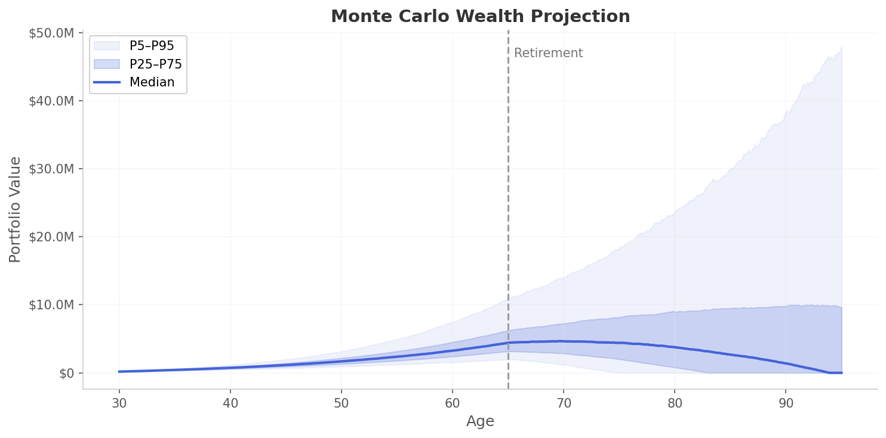
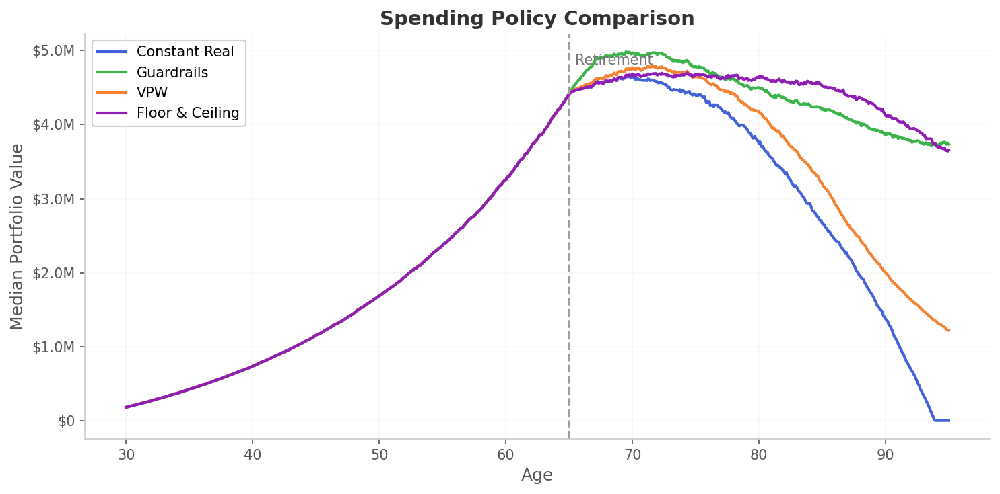
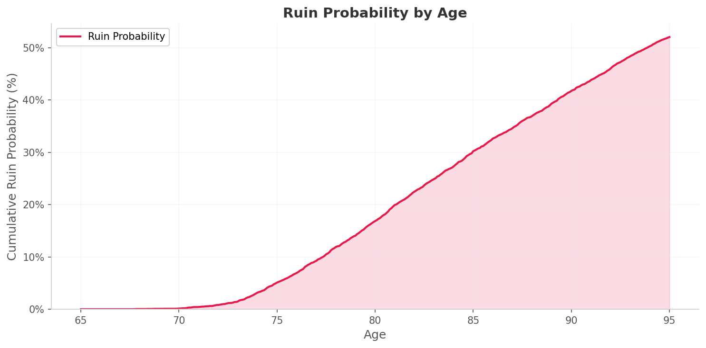

<p align="center">
  <h1 align="center">monteplan</h1>
  <p align="center">Monte Carlo financial planning simulator</p>
</p>

<p align="center">
  <a href="https://pypi.org/project/monteplan/"></a>
  <a href="https://monteplan.streamlit.app"></a>
  <a href="https://github.com/engineerinvestor/monteplan/actions"></a>
  
  <a href="https://github.com/engineerinvestor/monteplan/blob/main/LICENSE"></a>
  <a href="https://engineerinvestor.github.io/monteplan/"></a>
</p>

<p align="center">
  <a href="https://monteplan.streamlit.app">Live App</a> |
  <a href="https://pypi.org/project/monteplan/">PyPI</a> |
  <a href="https://engineerinvestor.github.io/monteplan/">Documentation</a> |
  <a href="https://github.com/engineerinvestor/monteplan/blob/main/paper/monteplan.pdf">Technical Paper</a> |
  <a href="https://engineerinvestor.github.io/monteplan/notebooks/">Notebooks</a> |
  <a href="https://colab.research.google.com/github/engineerinvestor/monteplan/blob/main/notebooks/01_getting_started.ipynb">Try in Colab</a>
</p>

---

monteplan models accumulation and decumulation with realistic taxes, multiple spending policies, multi-asset correlated portfolios, and professional reporting. Use it as a **Python library**, **CLI tool**, or interactive **Streamlit web app**.

## Features

- **Monte Carlo Engine** -- Vectorized numpy simulation with monthly time steps and deterministic seeding
- **4 Return Models** -- Multivariate normal, Student-t (fat tails), historical block bootstrap, Markov regime switching
- **5 Spending Policies** -- Constant real, percent-of-portfolio, Guyton-Klinger guardrails, VPW, floor-and-ceiling
- **Tax-Aware Withdrawals** -- US federal progressive brackets, LTCG rates, RMD enforcement, configurable withdrawal ordering
- **Multi-Account Support** -- Taxable, traditional (401k/IRA), and Roth accounts with distinct tax treatment
- **Guaranteed Income** -- Social Security, pensions, and annuities with COLA adjustments
- **Stress Testing** -- Market crashes, lost decades, high inflation, and sequence-of-returns risk scenarios
- **Sensitivity Analysis** -- One-at-a-time tornado charts and 2D heatmaps with parallel execution
- **Antithetic Variates** -- Variance reduction for tighter confidence intervals
- **Glide Paths** -- Age-based target allocation shifts
- **Investment Fees** -- Expense ratios, AUM fees, and advisory fees as monthly drag
- **Streamlit App** -- [Interactive web UI](https://monteplan.streamlit.app) with Plotly charts, scenario comparison, and CSV export

## Example Output

<p align="center">
  
</p>

<p align="center">
  
  
</p>

## Quick Start

### Python Library

```python
from monteplan import simulate, default_plan, default_market, default_policies, default_sim_config

result = simulate(default_plan(), default_market(), default_policies(), default_sim_config())
print(f"Success probability: {result.success_probability:.1%}")
```

### CLI

```bash
monteplan run --paths 10000 --seed 42
```

### Streamlit App

Try the [live app](https://monteplan.streamlit.app) or run locally:

```bash
pip install monteplan[app]
streamlit run app/Home.py
```

## Try It Now

[](https://colab.research.google.com/github/engineerinvestor/monteplan/blob/main/notebooks/01_getting_started.ipynb)

## Installation

Install from [PyPI](https://pypi.org/project/monteplan/):

```bash
pip install monteplan
```

Or install from source:

```bash
git clone https://github.com/engineerinvestor/monteplan.git
cd monteplan
pip install -e ".[dev]"
```

## Architecture

monteplan separates computation from presentation:

- **Engine** (`src/monteplan/`) -- Pure Python package with no UI dependencies
- **App** (`app/`) -- Streamlit web UI that imports the engine as a library
- **Plugin-style models** -- Return models, spending policies, and tax models are swappable via protocols

See the [documentation](https://engineerinvestor.github.io/monteplan/) for the full user guide, API reference, and mathematical details.

## Citing

If you use monteplan in academic work, please cite:

```bibtex
@software{monteplan,
  title        = {monteplan: Monte Carlo Financial Planning Simulator},
  author       = {{Engineer Investor}},
  year         = {2026},
  url          = {https://github.com/engineerinvestor/monteplan},
  version      = {0.6.0},
  license      = {Apache-2.0}
}
```

GitHub also provides a citation prompt via the repository's [CITATION.cff](CITATION.cff) file.

## Disclaimer

This is an educational tool for exploring financial planning concepts. It is **not financial advice**. Results are simulations based on simplified models and assumptions. Consult a qualified financial advisor for real planning decisions.

## License

Apache-2.0
